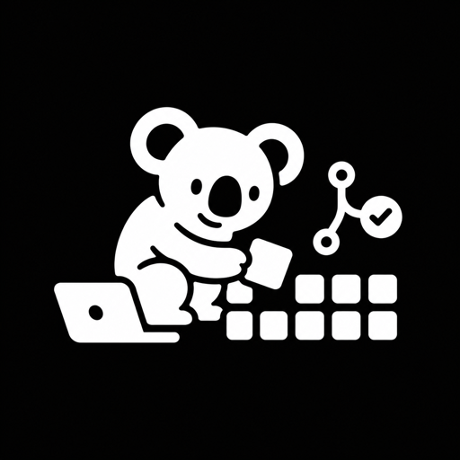

<p align="center">
  
</p>

<h1 align="center">Carmy</h1>

<p align="center">
  <em>Read the trail. Reuse what exists. Ship the smallest safe change.</em>
</p>

<p align="center">
  <a href="https://skills.sh/Rish-it/carmy"></a>
  
  
</p>

---

Most code changes do not need another dependency, abstraction, or rewrite.
They need someone to trace the real behavior, find what the codebase already
has, and make the narrowest change that holds.

Carmy brings that discipline to Claude Code and Codex. It is strict about
understanding first, reusing before adding, proving reproducible failures, and
leaving a small, verifiable diff.

## Before / after

You ask an agent to read one query parameter. It reaches for a parsing package,
builds a wrapper, and adds a utility for a browser feature that already exists.

With Carmy, it starts here:

```js
const query = new URLSearchParams(window.location.search);
```

Then it traces the callers and adds only the validation and behavior the task
actually requires. More focused walkthroughs live in [examples/](examples/).

## How it works

Before changing code, Carmy reads the affected flow and stops at the first
solution that satisfies the task:

```text
1. Does this need to exist?       → no: skip it
2. Is it already in this project? → reuse it
3. Does the standard library fit? → use it
4. Does the platform provide it?  → use it
5. Is a dependency already here?  → reuse it
6. Is one clear line enough?      → write one clear line
7. Otherwise                       → write the minimum maintainable code
```

Small is never an excuse to remove validation, error handling, security,
accessibility, or data-loss protection. The goal is the least change that is
still correct.

## Install

Carmy’s plugin hooks need Node.js 18.18.0 or newer on the non-interactive
`PATH` used by the host. The core skill still works if lifecycle hooks are not
available.

### Claude Code

Send these as separate prompts:

```text
/plugin marketplace add Rish-it/carmy
```

```text
/plugin install carmy@carmy
```

Reload plugins if prompted, then begin a new session.

### Codex

```bash
codex plugin marketplace add Rish-it/carmy
codex plugin add carmy@carmy
```

Start a new thread, open `/hooks`, inspect Carmy’s lifecycle hooks, and trust
them. Restart the desktop app after installation.

### skills.sh

For the instruction-only core skill:

```bash
npx skills add https://github.com/Rish-it/carmy --skill carmy
```

This path does not install commands, mode state, automatic activation,
subagent context, or the statusline badge.

## Modes and runtime

Carmy has two modes with the same rules and solution quality:

| Mode | Behavior |
|---|---|
| `cold` | Default. Minimal, technical diagnosis and solution. |
| `hot` | One short funny analogy, then the same tight solution. |

Use `/carmy cold` or `/carmy hot` in Claude Code, or `$carmy cold` and
`$carmy hot` in Codex. `:cold` and `:hot` are compact switches. `/carmy off`,
`stop carmy`, and `normal mode` turn it off for the current session.

Set the default for new sessions with `CARMY_DEFAULT_MODE` or this config file:

```json
{ "defaultMode": "hot" }
```

Save it at `~/.config/carmy/config.json` on macOS and Linux, or
`%APPDATA%\carmy\config.json` on Windows. Resolution is environment variable,
then config, then `cold`.

The active rules are injected into subagents too. Set
`CARMY_SUBAGENT_MATCHER` to a case-insensitive regular expression to limit that
to matching subagent types; leave it unset to cover every subagent.

## Commands

| Command | What it does |
|---|---|
| `/carmy [cold\|hot\|off]` | Set the session mode; no argument reports it. |
| `/carmy default cold\|hot` | Set the startup mode for future sessions. |
| `/carmy-review [target]` | Review a diff or branch against the workflow gates. |
| `/carmy-tdd [bug or behavior]` | Run the bundled public-behavior RED→GREEN protocol. |
| `/carmy-help` | Show the quick reference. |

In Codex, use `$carmy`, `$carmy-review`, `$carmy-tdd`, and `$carmy-help`.

## Update

Update the marketplace, then reload or restart the host:

```bash
codex plugin marketplace upgrade carmy
```

In Claude Code, open `/plugin`, update the Carmy marketplace, and reload
plugins when prompted.

## Uninstall

Run cleanup before removing the plugin. It deletes only Carmy’s mode flag,
default configuration, and Carmy-owned statusline segment:

```bash
node scripts/uninstall.js
```

Then remove the plugin:

```text
/plugin remove carmy
```

```bash
codex plugin remove carmy
```

## FAQ

**Does Carmy always choose one line?**
No. It chooses the first complete solution on the ladder. A larger change is
right when the task genuinely requires it.

**Does it need a configuration file?**
No. `cold` is the default; configuration only changes the default mode.

**Can I use the core skill without the plugin?**
Yes. Copy `skills/carmy/SKILL.md` or install through skills.sh. You get the
rules, but not lifecycle hooks, commands, persistent mode, subagent injection,
or the statusline badge.

## License

MIT. See [LICENSE](LICENSE).
